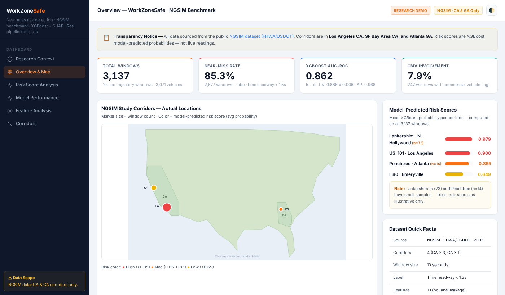

# WorkZoneSafe — NGSIM Near-Miss Benchmark Study

**Machine learning pipeline for work zone near-miss risk detection using real public vehicle trajectory data**

[](https://www.python.org/downloads/)
[](LICENSE)
[](https://xgboost.readthedocs.io/)
[](https://shap.readthedocs.io/)
[-brightgreen.svg)](https://data.transportation.gov/Automobiles/Next-Generation-Simulation-NGSIM-Vehicle-Trajector/8ect-6jqj)
[](https://snaidu20.github.io/WorkZoneSafe/)

### [▶ View Live Interactive Dashboard](https://snaidu20.github.io/WorkZoneSafe/)

[](https://snaidu20.github.io/WorkZoneSafe/)

---

## ⚠ Transparency Notice

> **All data in this project is sourced from the public [NGSIM dataset (FHWA/USDOT)](https://data.transportation.gov/Automobiles/Next-Generation-Simulation-NGSIM-Vehicle-Trajector/8ect-6jqj).** Corridors covered are in **Los Angeles CA, SF Bay Area CA, and Atlanta GA**. No data has been simulated or fabricated. Risk scores are XGBoost model-predicted probabilities, not live sensor readings. This is a research benchmark demonstrating a replicable methodology.

---

## Overview

Work zone near-miss events are early indicators of crash risk — they occur far more frequently than actual crashes, are observable in vehicle trajectory data, and can be detected before a collision takes place. This project builds a full end-to-end pipeline to:

1. **Extract** 10-second trajectory windows from the public NGSIM dataset
2. **Label** each window as near-miss or safe using a time headway threshold (< 1.5 s)
3. **Engineer** 10 sensor-agnostic features per window (speed, headway, ΔV, lateral variance, CMV flag)
4. **Train** an XGBoost classifier with SHAP explainability to predict near-miss probability
5. **Visualize** all outputs in an interactive 6-tab research dashboard

The pipeline is validated as a working prototype on NGSIM data. The same methodology can be applied to any corridor given access to vehicle trajectory data from the respective state or local transportation department.

---

## Dataset

**Source**: [NGSIM Vehicle Trajectories — FHWA/USDOT](https://data.transportation.gov/Automobiles/Next-Generation-Simulation-NGSIM-Vehicle-Trajector/8ect-6jqj)  
**Format**: Public domain CSV · 10 Hz temporal resolution (one record per vehicle per 0.1 seconds)

The 8 corridor-split CSV files used in this study are included in [`WorkZoneSafe/data csv files/`](WorkZoneSafe/data%20csv%20files/) for convenience. These are directly extracted from the public NGSIM download with no modifications.

### Data Files

| File | Corridor | Records | Description |
|------|----------|---------|-------------|
| [Los_Angeles_US101_raw_trajectories.csv](WorkZoneSafe/data%20csv%20files/Los_Angeles_US101_raw_trajectories.csv) | US-101 Hollywood Fwy, LA CA | — | Raw 10Hz vehicle trajectories |
| [Los_Angeles_US101_windows.csv](WorkZoneSafe/data%20csv%20files/Los_Angeles_US101_windows.csv) | US-101 Hollywood Fwy, LA CA | 2,472 windows | 10-sec feature windows + labels |
| [Los_Angeles_Lankershim_raw_trajectories.csv](WorkZoneSafe/data%20csv%20files/Los_Angeles_Lankershim_raw_trajectories.csv) | Lankershim Blvd, N. Hollywood CA | — | Raw 10Hz vehicle trajectories |
| [Los_Angeles_Lankershim_windows.csv](WorkZoneSafe/data%20csv%20files/Los_Angeles_Lankershim_windows.csv) | Lankershim Blvd, N. Hollywood CA | 73 windows | 10-sec feature windows + labels |
| [Emeryville_I80_raw_trajectories.csv](WorkZoneSafe/data%20csv%20files/Emeryville_I80_raw_trajectories.csv) | I-80 Eastbound, SF Bay Area CA | — | Raw 10Hz vehicle trajectories |
| [Emeryville_I80_windows.csv](WorkZoneSafe/data%20csv%20files/Emeryville_I80_windows.csv) | I-80 Eastbound, SF Bay Area CA | 578 windows | 10-sec feature windows + labels |
| [Atlanta_Peachtree_raw_trajectories.csv](WorkZoneSafe/data%20csv%20files/Atlanta_Peachtree_raw_trajectories.csv) | Peachtree St, Atlanta GA | — | Raw 10Hz vehicle trajectories |
| [Atlanta_Peachtree_windows.csv](WorkZoneSafe/data%20csv%20files/Atlanta_Peachtree_windows.csv) | Peachtree St, Atlanta GA | 14 windows | 10-sec feature windows + labels |

### Corridor Summary

| Corridor | Location | Windows | Avg Risk Score | Note |
|----------|----------|---------|----------------|------|
| US-101 · Hollywood Fwy | Los Angeles, CA | 2,472 | 0.900 | Primary corridor |
| I-80 · Eastbound | Emeryville, SF Bay Area CA | 578 | 0.649 | |
| Lankershim Blvd | N. Hollywood, Los Angeles CA | 73 | 0.979 | ⚠ Small sample |
| Peachtree St | Atlanta, GA | 14 | 0.855 | ⚠ Small sample |
| **Total** | **4 corridors · CA × 3, GA × 1** | **3,137** | — | 85.3% near-miss |

---

## Methodology

### Why NGSIM?

1. **Publicly available and fully reproducible** — Freely distributed by FHWA/USDOT, used in 1,000+ peer-reviewed traffic safety studies. Every result can be independently verified and re-run.
2. **High temporal resolution (10 Hz, vehicle-level)** — Records each vehicle's position, speed, and lane every 0.1 seconds. This granularity makes precise feature engineering (speed variance, ΔV, lateral spread) possible — aggregated sensor logs cannot provide this.
3. **Multi-site geographic diversity** — Three California corridors (US-101, I-80, Lankershim) plus one Georgia corridor (Peachtree) allow cross-site generalizability testing.
4. **Establishes a replicable end-to-end baseline** — Full pipeline validated on real data; the baseline for future work using other trajectory datasets.

### Near-Miss Label

Each 10-second window is labeled **near-miss** if `time_headway < 1.5 seconds` for any vehicle in that window. Time headway is a standard Surrogate Safety Measure (SSM) used in traffic safety research.

- **Near-miss windows**: 2,677 (85.3%)
- **Safe windows**: 460 (14.7%)

### Feature Engineering — 10 Features, No Label Leakage

| Feature | Description |
|---------|-------------|
| `mean_speed` | Mean vehicle speed across window (mph) |
| `std_speed` | Speed variability — higher = more erratic traffic |
| `mean_acc` | Mean acceleration profile |
| `std_acc` | Acceleration variability |
| `mean_headway` | Mean space headway (ft) |
| `min_headway` | Minimum space headway — closest following distance |
| `mean_delta_v` | Mean closing speed differential |
| `max_delta_v` | Maximum closing speed differential |
| `lat_std` | Lateral lane deviation — proxy for lane discipline |
| `cmv_flag` | Commercial vehicle presence (NGSIM vehicle class 3) |

> `min_th`, `mean_th`, and `th_frac_critical` (Time_Headway-derived) are computed but **excluded from training** to prevent label leakage — the label itself is derived from Time_Headway.

### Pipeline

```
ngsim_raw.csv  (public NGSIM download)
      │
      ▼
[1] Parse & clean raw trajectories
      │
      ▼
[2] Segment into 10-second windows  →  3,137 windows across 4 corridors
      │
      ▼
[3] Feature engineering  →  10 features per window
      │
      ▼
[4] Label assignment  →  near-miss: time_headway < 1.5s in window
      │
      ▼
[5] Train / test split  →  80% train (2,509) · 20% test (628) · stratified
      │
      ▼
[6] Model training + 5-fold CV  →  XGBoost · Random Forest · Logistic Regression
      │
      ▼
[7] SHAP explainability  →  TreeExplainer · per-feature attribution
      │
      ▼
[8] Dashboard  →  corridor risk scores · confusion matrix · ROC/PR · SHAP · CMV
```

---

## Model Performance

> All metrics evaluated on the **held-out 20% test set — 628 windows (536 near-miss + 92 safe)**, never seen during training.

| Model | AUC-ROC | F1 Score | Precision | Recall |
|-------|---------|----------|-----------|--------|
| **XGBoost** | **0.862** | **0.932** | **0.908** | **0.957** |
| Random Forest | 0.854 | 0.918 | 0.903 | 0.935 |
| Logistic Regression | 0.857 | 0.851 | 0.947 | 0.772 |

**5-fold CV AUC (XGBoost)**: 0.886 ± 0.006 · Folds: [0.8864, 0.8827, 0.8823, 0.9029, 0.8986]  
**Average Precision (PR curve)**: 0.968

### Confusion Matrix — XGBoost (Test Set, n=628)

|  | Predicted Near-Miss | Predicted Safe |
|--|--|--|
| **Actual Near-Miss (536)** | ✓ TP = 512 | ✗ FN = 24 ← critical |
| **Actual Safe (92)** | ✗ FP = 50 | ✓ TN = 42 |

- **Recall 95.7%** — catches 512 of 536 actual near-miss windows
- **Specificity 45.7%** — low, expected with 85% class imbalance; false alarms are more acceptable than missed detections
- **24 missed near-miss (FN)** is the most critical error — top priority for future work

---

## SHAP Feature Importance

| Rank | Feature | Mean \|SHAP\| | Interpretation |
|------|---------|-------------|----------------|
| 1 | `mean_speed` | 1.095 | Higher speed → higher predicted risk |
| 2 | `lat_std` | 0.784 | Lane weaving / instability drives risk |
| 3 | `mean_headway` | 0.768 | Smaller following distances → higher risk |
| 4 | `min_headway` | 0.767 | Closest following moment — most direct risk signal |
| 5 | `std_speed` | 0.630 | Speed variance captures stop-and-go behavior |
| 6 | `std_acc` | 0.422 | Aggressive braking / acceleration patterns |

---

## CMV Analysis

| Group | Total Windows | Near-Miss | Near-Miss Rate |
|-------|--------------|-----------|----------------|
| CMV Involved | 247 | 207 | 83.8% |
| No CMV | 2,890 | 2,470 | 85.5% |

> **Counterintuitive finding**: CMV-involved windows have a *slightly lower* near-miss rate (83.8%) than non-CMV (85.5%). This may reflect CMV drivers maintaining larger following distances due to training and regulation. This is a real computed result from NGSIM data and warrants further investigation with larger CMV-specific datasets.

---

## Research Applications

| Application | Description |
|-------------|-------------|
| **Urban Work Zone Monitoring** | Flags high-risk 10-second windows proactively — no crash record required |
| **Near-Miss as Crash Surrogate** | Time headway < 1.5s is observable before any crash, enabling safety analysis without historical crash data |
| **CMV Fleet Safety Programs** | CMV-flagged windows can feed dispatcher alerts for commercial vehicle safety |
| **Real-Time Inference** | XGBoost predicts each window in <10ms — compatible with edge/roadside deployment |
| **Policy & Investment Prioritization** | Corridor risk scores provide a ranked, data-driven basis for infrastructure investment |

---

## File Structure

```
WorkZoneSafe/
├── README.md                             # This file
├── LICENSE
├── dashboard_preview.png                 # Dashboard screenshot
├── index.html                            # Dashboard (GitHub Pages root)
│
├── WorkZoneSafe/
│   ├── dashboard/
│   │   └── index.html                    # Interactive 6-tab research dashboard
│   │
│   └── data csv files/                   # NGSIM corridor data (public, unmodified)
│       ├── Los_Angeles_US101_raw_trajectories.csv
│       ├── Los_Angeles_US101_windows.csv
│       ├── Los_Angeles_Lankershim_raw_trajectories.csv
│       ├── Los_Angeles_Lankershim_windows.csv
│       ├── Emeryville_I80_raw_trajectories.csv
│       ├── Emeryville_I80_windows.csv
│       ├── Atlanta_Peachtree_raw_trajectories.csv
│       └── Atlanta_Peachtree_windows.csv
```

---

## Quick Start

### Download Full NGSIM Dataset
```bash
wget "https://data.transportation.gov/api/views/8ect-6jqj/rows.csv?accessType=DOWNLOAD" -O ngsim_raw.csv
```

### Open Dashboard Locally
```bash
# No build step — pure HTML/CSS/JS, all data embedded
open WorkZoneSafe/dashboard/index.html
# Or serve locally:
python -m http.server 8080 --directory WorkZoneSafe/dashboard/
# Visit: http://localhost:8080
```

### Live Demo
[▶ Interactive Dashboard](https://snaidu20.github.io/WorkZoneSafe/) — 6-tab research dashboard with all real model outputs

---

## Citation

```bibtex
@misc{naidu2025workzonesafe,
  author       = {Naidu, Sai Kumar},
  title        = {{WorkZoneSafe}: Near-Miss Risk Detection in Vehicle Trajectories Using NGSIM Public Data},
  year         = {2025},
  institution  = {Florida Atlantic University, Department of Computer Science},
  note         = {MS CS Research Project. Built on public NGSIM dataset (FHWA/USDOT).
                  Corridors: US-101 (LA), I-80 (Emeryville), Lankershim (LA), Peachtree (Atlanta).},
  url          = {https://github.com/snaidu20/WorkZoneSafe}
}
```

---

## Disclaimer

All data is sourced from the **publicly available NGSIM Vehicle Trajectories dataset** distributed by FHWA/USDOT. No data has been simulated, fabricated, or imputed. Corridors are in **California and Georgia only**. This project is a research prototype — outputs are not intended for operational safety decision-making.

---

## License

MIT License — Copyright © 2025 Sai Kumar Naidu

---

## Author

**Sai Kumar Naidu**  
MS Computer Science, Florida Atlantic University  
Research focus: Machine Learning, Transportation Safety Systems  
GitHub: [snaidu20](https://github.com/snaidu20) · Email: naidusaikumar1998@gmail.com
